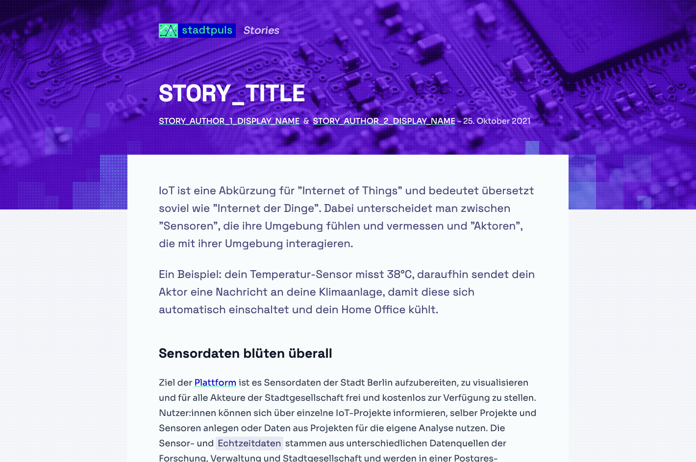

# **Stadtpuls** Story Template

[](https://stories.stadtpuls.coms)

A vanilla HTML/JS/CSS template for creating stories using **[stadtpuls.com](https://stadtpuls.com)** sensor data.

## What is **Stadtpuls** ?

**Stadtpuls** (german for "city pulse") is Berlin's open platform for sensor data. Hardware hobbyists, activists, public institutions but also businesses can use **Stadtpuls** to share their sensor data to the world and enable others to leverage it for other purposes. Think of it as the GitHub for sensor data.

**Stadtpuls** is an open source project by the [CityLAB Berlin](https://www.citylab-berlin.org/), a project of the [Technologiestiftung Berlin](https://github.com/technologiestiftung), supported by the [Senate Chancellery Berlin](https://www.berlin.de/rbmskzl/en/).

## What are **Stadtpuls** Stories?

**Stadtpuls** stories are standalone web articles that show how sensor data can be used in creative ways by combining text, images, static charts and interactive data visualizations to gather compelling insights. Which streets are the loudest? Which neighborhoods contribute most to the CO2 emissions and why? What are the favorite Sunday walk routes? **Stadtpuls** provides interesting live sensor data which can be used for citizen science projects for free. Stories are like advanced blog articles in the form of micro-sites. They tell stories through data.

## About the code

This repo requires neither NodeJS nor a build tool. It is intentionally [_**vanilla**_](https://en.wikipedia.org/wiki/Vanilla_software) in order to make it easier for anybody with basic HTML/CSS/JavaScript skills to dive straight into creating their own story.

It does, however, import some external CSS stylesheets and JavaScript scripts for convenience. Those are:

- [**Tailwind Preflight**](https://tailwindcss.com/docs/preflight):<br />A CSS reset setup created by TailwindCSS build on top of [modern-normalize](https://github.com/sindresorhus/modern-normalize).
- [**Tailwind Typography**](https://github.com/tailwindlabs/tailwindcss-typography):<br />A CSS stylesheet that provides a set of prose classes to add beautiful typographic defaults to the article main text area.
- [**Highlight JS**](https://highlightjs.org/):<br />A JS plugin that provides syntax highlighting for code blocks.
- [**Highlight JS - Theme "Shades of Purple"**](https://highlightjs.org/static/demo/):<br />A CSS stylesheet for styling code highlighted by the [Highlight JS](https://highlightjs.org/) plugin.
- [**Chart.js**](https://www.chartjs.org):<br />A JS charting library used to display data visualization (You could also use [D3.js](https://d3js.org/) or any other library instead).
- [**Mapbox GL JS**](https://docs.mapbox.com/mapbox-gl-js/guides/):<br/>A JS library for creating interactive web maps. Used for the display of sensor cards (can be removed if not used).
- [**Mapbox GL CSS**](https://docs.mapbox.com/mapbox-gl-js/guides/):<br/>The CSS styles associated withe the [**Mapbox GL JS**](https://docs.mapbox.com/mapbox-gl-js/guides/) library (can be removed if not used).

The above libraries are useful for specific reasons (as cited above), however, none of these are mandatory. Therefore, feel free to add or remove any library you deem important to tell your own story.

### Creating your own story

This repository is intended to be extended with your own compelling stories! There are two ways you can go about using the code:

#### 1. Download the files

The easiest way is to download the whole repository and simply directly modify the files (see below for more information on how to do it).

The advantage of this solution is that it is easy and straight forward. The disadvantage is that you won't be able to receive the updates we push to our own template. If you don't care about the updates, this solution is for you.

#### 2. Make a Pull Request

This solution is more advanced and requires you to be familiar with [git](https://git-scm.com/) and [GitHub's Pull Request feature](https://docs.github.com/en/pull-requests/collaborating-with-pull-requests/proposing-changes-to-your-work-with-pull-requests/about-pull-requests). Because GitHub repositories are versioned via git, you can have your own local copy of the code, make changes, and later request the author of the original code (in this case us) to merge your local changes into the main repository.

If you aren't familiar with theses concepts, stick to the first solution or learn more about [what a Pull Request is](https://docs.github.com/en/pull-requests/collaborating-with-pull-requests/proposing-changes-to-your-work-with-pull-requests/about-pull-requests).

### The code structure

The code structure is simple and minimal. Here is an overview of the most important areas:

```sh
.
├── design-resources       # Design files for creating imagery
├── src                    # All the code happens here
│   ├── common             # Common resources used by all stories
│   ├── template           # The folder to duplicate to make your changes into
│   │   ├── images         # Images Specific to your story
│   │   ├── vendor         # External libraries particular to your story (optional)
│   │   ├── index.html     # The main file, in which your story is written
│   │   ├── styles.css     # Your custom CSS styles go here (optional)
│   │   └── charts.js      # The JS for rendering your story charts goes here
│   ├── one-story-here     # The folder to duplicate to put your changes into
│   ├── another-story-here # The folder to duplicate to put your changes into
│   └── index.html         # The file with an overview of all stories.
├── .gitignore             # Tells git what to ignore for versioning
├── .prettierrc.js         # Tells prettier how to format code
└── README.md              # This very file
```

### Preparing the code

You will need to create your own folder with you own story code. This mostly consists of an `index.html` file and an `images` folder. In the `src` folder, there is a folder called `template`. Duplicate this folder and rename it after your story. The name of the folder should contain only URL-compatible characters (you can turn the name of your story title into a URL compatible string [here](https://slugify.online/)).

If you need a specific JS library or particular CSS styles, add the relevant files within your newly created folder following the structure of the `common` folder (see "The Code Structure" section above). Don't forget to link the files in your `index.html` file too.

Once this is done, you will be able to add your story to the list in the overview. This happens in the `index.html` placed directly in the `src` folder. In this file, find the first anchor tag with the `stories-list-item` class, duplicate it, and adapt its content and URLs based on your new story. Make sure to respect the sorting, which is newest first, oldest last.

### Adapting the meta-code

Aside from the story's content itself, there are a few things you should change first.
Search and replace the following texts in the `index.html` with your values:

- `STORY_TITLE`:<br />The title of your article/story (about 65 to 70 characters including spaces)
- `STORY_DESCRIPTION`:<br />A short description of your article/story (about 120 to 158 characters including spaces)
- `STORY_KEYWORD`:<br />A coma-separated list keywords related to your article/story (between 10 to 30 keywords)
- `STORY_AUTHOR_TWITTER_ACCOUNT`:<br />The author's twitter username (If not needed/wanted, remove the relevant HTML/CSS code)
- `STORY_SLUG`:<br />If you publish the story yourself, change the whole URL. Otherwise, replace `STORY_SLUG` with the name of the story in _"slug"_ form. You can slugify the story title [here](https://slugify.online/).
- `STORY_PUBLICATION_DATE`:<br />The official publication date of your story.

---

<small>**Caution**: Replace `N` by the author's number</small>

- `STORY_AUTHOR_N_DISPLAY_NAME`:<br />The author's display name.
- `STORY_AUTHOR_N_ROLE`:<br />The author's role (eg. _"Open Data Researcher"_).
- `STORY_AUTHOR_N_BIO`:<br />A super short bio (eg. _"Dr. Benjamin Seibel leitet das Ideation & Prototyping Lab und betreute zuvor Open Data-Projekte bei der Technologiestiftung Berlin."_).
- `STORY_AUTHOR_N_STADTPULS_USERNAME`:<br />Stadtpuls.com username (You can find it in the URL of the author's profile page on Stadtpuls.com).
- `STORY_AUTHOR_N_TWITTER_USERNAME`:<br />author's twitter.com username (Or Remove the HTML link if not wished).
- `STORY_AUTHOR_N_PORTFOLIO_URL`:<br />author's portfolio URL (Or Remove the HTML link if not wished).

---

Some images should be adapted as well:

- `src/YOUR-STORY/images/social-image.jpg`: This file is the preview that is displayed when sharing via social media or messenger apps such as Slack or WhatsApp.
- `src/YOUR-STORY/images/author-1.png` and `src/YOUR-STORY/images/author-2.png`: The portraits of the authors.

These images were made with the [Sketch app](https://www.sketch.com/). The design files are in the `design-resources` folder. Additionally we provide [Adobe Photoshop](https://www.adobe.com/de/products/photoshop.html) templates which are also in the `design-resources` folder. If you don't own Photoshop, you can use the free and open source [Krita App](https://krita.org/en) to open the Photoshop templates.

### Adapting the content code

The main content of the story happens in the `<article>` HTML tag. However, the hero section containing the title, authors and publication date are placed within the `<header>` tag.

#### Basic formatting

Basic formatting tags such as `<strong>`, `<em>`, `<blockquote>`, `<h1>` to `<h6>`, `<code>`, `<p>`, etc. are formatted automatically. This is due to the `prose` CSS class applied to their parent `<section>` elements. These automatic styles are provided by the [Tailwind Typography](https://github.com/tailwindlabs/tailwindcss-typography) and some custom adaptations in the `styles.css` file.

#### Helper classes for styling

There are a few CSS classes that help with styling:

- `.lead`:<br />This CSS class adds an "introduction" style. Slightly bigger and lighter, the `.lead` class should be used at the beginning of an article to incentivize users to start reading further.
- `.alert`:<br />Alerts are styled boxes that are highlighted. They can be used to momentarily derivate from the main content and provide context information. They come in the following flavors: `.alert.alert-info` (should be used by default), `.alert.alert-warning`, `.alert.alert-success`, `.alert.alert-error`
- `.wide-block`:<br />Utility CSS class to create blocks that are wider than the main text content. Useful for bringing rhythm and/or placing larger charts.
- `.tag`:<br />Utility to highlight a text referencing a specific dataset in a chart with the same color. Can set the color using the CSS variable `--data-color`. This can be set on an element-basis with an inline style tag. (Example: ` <span class="tag" style="--data-color: var(--purple)">Datenarchitektur</span>`)

#### Referencing a Stadtpuls sensor

There is a special HTML structure and JavaScript code that can be used to show a little Card showing information about a Stadtpuls sensor. Just add the HTML element below, and information about the sensor with the provided ID will be fetched and automatically filled into the a tag.

<small>**HTML**</small>:

```html
<a class="sensor-card" data-sensor-id="10"></a>
```

### Developing workflow

If you have [NodeJS](https://nodejs.org/en/) installed, you can use [`browser-sync`](https://browsersync.io/) to auto watch and reload your code in a little development server. This makes it faster and more convenient. You can use the following command in the terminal:

```sh
npx browser-sync start -s 'src' -f 'src' --no-notify --host $LOCAL_IP --port 9000
```

### Send us your story!

Did you create your own story? Great! We can highlight and promote your story on our website and social media channels. Create a Pull Request or send us the zipped code folder at [info@stadtpuls.com](mailto:info@stadtpuls.com). We'll take care of the rest and get in touch with you once all is ready!

---

Made with :heart: [@CityLAB Berlin](https://www.citylab-berlin.org/)

<!-- touch by ff6347 -->

## Contributors ✨

Thanks goes to these wonderful people ([emoji key](https://allcontributors.org/docs/en/emoji-key)):

<!-- ALL-CONTRIBUTORS-LIST:START - Do not remove or modify this section -->
<!-- prettier-ignore-start -->
<!-- markdownlint-disable -->
<table>
  <tr>
    <td align="center"><a href="https://github.com/vogelino"><br /><sub><b>Lucas Vogel</b></sub></a><br /><a href="https://github.com/technologiestiftung/stadtpuls-story-template/commits?author=vogelino" title="Code">💻</a> <a href="#design-vogelino" title="Design">🎨</a> <a href="https://github.com/technologiestiftung/stadtpuls-story-template/commits?author=vogelino" title="Documentation">📖</a></td>
    <td align="center"><a href="https://github.com/dnsos"><br /><sub><b>Dennis Ostendorf</b></sub></a><br /><a href="https://github.com/technologiestiftung/stadtpuls-story-template/commits?author=dnsos" title="Code">💻</a> <a href="https://github.com/technologiestiftung/stadtpuls-story-template/commits?author=dnsos" title="Documentation">📖</a></td>
    <td align="center"><a href="https://fabianmoronzirfas.me/"><br /><sub><b>Fabian Morón Zirfas</b></sub></a><br /><a href="https://github.com/technologiestiftung/stadtpuls-story-template/commits?author=ff6347" title="Code">💻</a> <a href="https://github.com/technologiestiftung/stadtpuls-story-template/commits?author=ff6347" title="Documentation">📖</a> <a href="#content-ff6347" title="Content">🖋</a></td>
    <td align="center"><a href="https://github.com/Lisa-Stubert"><br /><sub><b>Lisa-Stubert</b></sub></a><br /><a href="#content-Lisa-Stubert" title="Content">🖋</a> <a href="https://github.com/technologiestiftung/stadtpuls-story-template/commits?author=Lisa-Stubert" title="Code">💻</a></td>
    <td align="center"><a href="https://github.com/ester-t-s"><br /><sub><b>Ester</b></sub></a><br /><a href="https://github.com/technologiestiftung/stadtpuls-story-template/commits?author=ester-t-s" title="Code">💻</a> <a href="#content-ester-t-s" title="Content">🖋</a></td>
    <td align="center"><a href="http://www.awsm.de/"><br /><sub><b>Ingo Hinterding</b></sub></a><br /><a href="https://github.com/technologiestiftung/stadtpuls-story-template/commits?author=Esshahn" title="Code">💻</a> <a href="#content-Esshahn" title="Content">🖋</a></td>
  </tr>
</table>

<!-- markdownlint-restore -->
<!-- prettier-ignore-end -->

<!-- ALL-CONTRIBUTORS-LIST:END -->

This project follows the [all-contributors](https://github.com/all-contributors/all-contributors) specification. Contributions of any kind welcome!